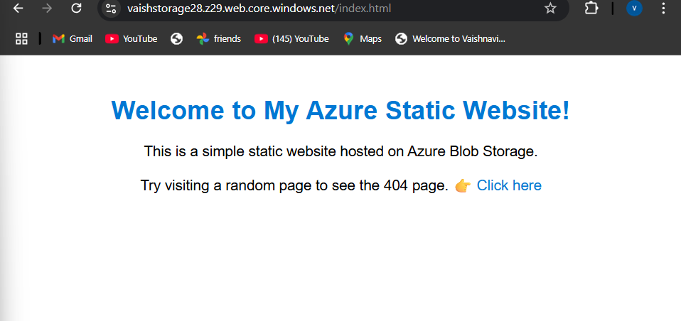
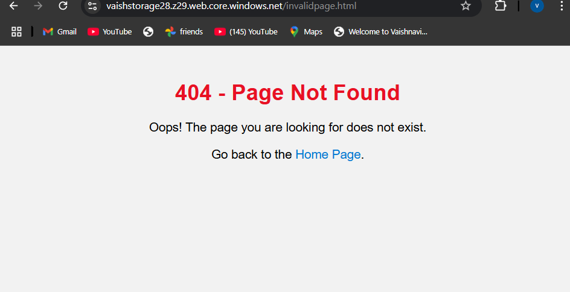

# Azure Static Website Demo

This is a mini project to host a simple static website on Microsoft Azure Blob Storage.  
It shows how beginners can deploy basic HTML pages to the cloud easily.

---

Project Files
MyStaticWebsite
1. index.html - Home page
2. 404.html - Custom 404 error page

Live Demo

URL: https://vaishstorage28.z29.web.core.windows.net/

## 📸 Screenshots

home page

error page

Features

- Static HTML site hosted on Azure Blob Storage
- Custom 404 error page
- Fully working basic HTML & CSS
- No server needed — just upload to Azure

  
HOW I MADE THIS:
1️. Wrote simple HTML files (index.html & 404.html).  
2️. Created a Storage Account on Azure Portal.  
3️. Enabled Static Website option.  
4️. Uploaded files to $web container.  
5️. Accessed my site via the Azure static website primary endpoint.

Author

Vaishnavi Muthyala 
Beginner Cloud Enthusiast | Learning Azure step by step ☁️_

License

This project is for learning/demo purposes only.
